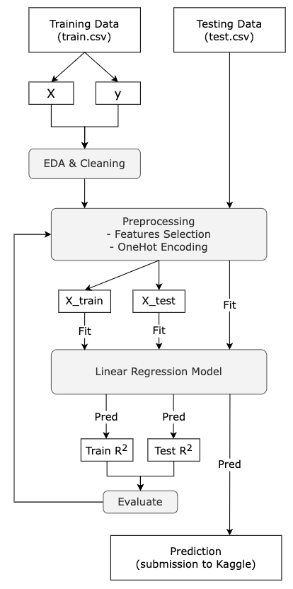

# Tina's Project - Ames House Sales Price Prediction
The goal of this project is to build a regression model based on the Ames Housing Dataset and predict the sale price of each house in the testing dataset.

We are provided two datasets, train.csv and test.csv, from [Kaggle](https://www.kaggle.com/competitions/dsir-919-project-2). These datasets including 2,051 observations in training dataset for us to train our model and 878 observations in testing dataset for us to predict the sale price. Both of them have 80 features of each houses. And the description of the datasets can be found [here](https://www.kaggle.com/competitions/dsir-919-project-2/data).

---
## EDA

There are mainly two types of features in our datasets - numerical and categorical. Therefore, I will explore them separately. 

**1. EDA - Numerical Features**
 * **Step 1:** According to the correlation between the target variable (Sale Price) and other numerical features, select the top-impact features of the sale price. And remove some features that have high impact to each other.
 * **Step 2:** Take a glance at the patterns between each selected numerical feature and the sale price by using scatter plots and box plots.
 * **Step 3:** Create some new numerical features, such as `total_sqft` (the total area of the house in sqft), and add them to both of the datasets.
 * **Step 4:** Final selection of the top most-impact numerical features. And remove some features that have high impact to each other.

**2. EDA - Categorical Features**
 * Plot box plots of each categorical features and see the patterns between them and the sale price.

**3. EDA - Target Variable (Sale Price)**
 * Use histogram to see the distribution of sale price.
 * Found that the sale price is right skewed. Therefore, plot a histogram to see the distribution of sale price after taking the sale price in logarithm.

```
* code: 01_EDA_and_Cleaning.ipynb
* data input: train.csv, test.csv
* data output: train_cleaned.csv, test_cleaned.csv
```
## Data Cleaning
1. Checking all missing values in selected numerical features. And fill them accordingly.
2. Checking all missing values in selected categorical features. And fill them accordingly.
3. Output the cleaned datasets in data file to be used in the next step.

```
* code: 01_EDA_and_Cleaning.ipynb
* data input: train.csv, test.csv
* data output: train_cleaned.csv, test_cleaned.csv
```
---
## Data Preprocessing
After cleaning the datasets, I can now take a deeper look on our features and focus more on the feature selection.
1. Column Selection - Numerical Features
 * Select the numerical features that I have selected in the previous steps (EDA and Cleaning).
 * Plot heatmap to see the correlation only between selected numerical features but without target variable.

2. Column Selection - Categorical Features
 * **Select features:** According to the box plots in the EDA process, select those features that have significant patterns with the sale price.
 * **Transform feature data types:** When I looked closer to the categorical features, I found there were some categorical features can be transformed to numerical data due to their quantity logic between their labels. For example, `Garage Qual` can be relabeled from 'Ex' (Excellent) to 5, 'Gd' (Good) to 4, and etc.
 
 
 Take a look at all the correlation between numerical features again and remove closed-related features.

```
* code: 02_Preprocessing_and_Feature_Engineering.ipynb
* data input: train_cleaned.csv, test_cleaned.csv
* data output: train_ready.csv, test_ready.csv, train_ready_2.csv, test_ready_2.csv
```
## Feature Engineering
Now, I have selected all the numerical and categorical features that I would like to use to train my model. Last process before trainning model is feature engineering.

 * **Dummy the Categorical Features:** transfer and expand all labels in the categorical features I selected to 0s and 1s (using `pandas get_dummies`).
 * **Output Ready Datasets**

```
* code: 02_Preprocessing_and_Feature_Engineering.ipynb
* data input: train_cleaned.csv, test_cleaned.csv
* data output: train_ready.csv, test_ready.csv, train_ready_2.csv, test_ready_2.csv
```
---
## Model Training
In this project, we were asked to use regression model for prediction. Thus, I choosed the Linear Regression model to make the prediction.

1. Model 1.1: (X and y)
 * training score: 0.899
 * testing score: 0.875
 * cross-validation score: 0.881
    - On average, features in model 1.1 can explain around 88% of the variability in sale price.
    
2. Model 1.2: (X and log(y))
 * training score: 0.912
 * testing score: 0.896
 * cross-validation score: 0.896
    - On average, features in model 1.2 can explain around 90% of the variability in sale price.
    
After I built up these two models above, I went back to features selection part in `02_Preprocessing_and_Feature_Engineering.ipynb` to re-select the features I would like to train for new models.

3. Model 2.1: (X and y)
 * training score: 0.893
 * testing score: 0.875
 * cross-validation score: 0.880
    - On average, features in model 1.1 can explain around 88% of the variability in sale price.
    
4. Model 2.2: (X and log(y))
 * training score: 0.910
 * testing score: 0.889
 * cross-validation score: 0.895
    - On average, features in model 1.2 can explain around 90% of the variability in sale price.

In the end, I built totally 4 models for Kaggle submission. But I found there are no significant improvment between the first features set and the second one. Also, these 4 models are all slightly overfitting since their training scores are higher than the testing scores.

```
* code: 03_Model_1_Linear_Regression.ipynb, 03_Model_2_Linear_Regression.ipynb
* data input: train_ready.csv, test_ready.csv, train_ready_2.csv, test_ready_2.csv
* model output: model_101.model, model_102.model, model_201.model, model_202.model
```
---
## Kaggle Submission
The scores I got from Kaggle for each model:
 * Model 1.1: 27843
 * **Model 1.2: 21015** --> the highest
 * Model 2.1: 29011
 * Model 2.2: 21345

```
* code: 04_Kaggle_Submission.ipynb
* data input: test_ready.csv, test_ready_2.csv
* data output: model_101_sub.csv, model_102_sub.csv, model_201_sub.csv, model_202_sub.csv
* model input: model_101.model, model_102.model, model_201.model, model_202.model
```
---
## Summary
* Take target variable in logarithm can make a better prediction in this case.
* Overall, all models I built in this project can explain about 90% of the variability in sale price, which is good!

---
## Business Recommendations
Let’s travel back to 2010. And you are people who want to or plan to buy a house here in Ames city in 2010. 

Houses with these features can have a higher price:
 * Located in a high sale price level neighborhood
 * New big house
 * Great overall quality
 * Totally 3 to 4 bathrooms
 * With bigger garage area
 * With paved alley to the house
 * Good exposure of basement

To find a reasonable price for the house you saw on sale: 
 * Find a neighborhood level where the price is within your budget.
 * Appropriate house size, overall quality, and age for you
 * And then, use our model to predict the reasonable price for the house you find interesting in.

---
## Project Model Workflow


---
## Directory Structure
```
Ames-house-sales-price-prediction
|__ ames_house_presentation_slides.pdf
|__ code
|   |__ 01_EDA_and_Cleaning.ipynb   
|   |__ 02_Preprocessing_and_Feature_Engineering.ipynb   
|   |__ 03_Model_1_Linear_Regression.ipynb
|   |__ 03_Model_2_Linear_Regression.ipynb  
|   |__ 04_Kaggle_Submissions.ipynb
|   |__ model
|       |__ model_101.model
|       |__ model_102.model
|       |__ model_201.model
|       |__ model_202.model
|
|__ data
|   |__ model_101_sub.csv
|   |__ model_102_sub.csv
|   |__ model_201_sub.csv
|   |__ model_202_sub.csv
|   |__ test.csv
|   |__ test_cleaned.csv
|   |__ test_ready.csv
|   |__ test_ready_2.csv
|   |__ train.csv
|   |__ train_cleaned.csv
|   |__ train_ready.csv
|   |__ train_ready_2.csv
|
|__ images
|   |__ abg_area_sp.png
|   |__ back-to-2010.png
|   |__ dist_sp.png
|   |__ garage_sp.png
|   |__ house_images.png
|   |__ Nbh_sp_growth.png
|   |__ project_2_workflow.png
|   |__ sqft_sp_with_overallqual.png
|   |__ sqft_sp_with_ttbaths.png
|   |__ tinap.png
|   |__ ttbsmt_sp.png
|   |__ yrbuilt_sp.png
|   |__ yrbuilt_sp_with_overallqual.png
|
|__ README.md
```